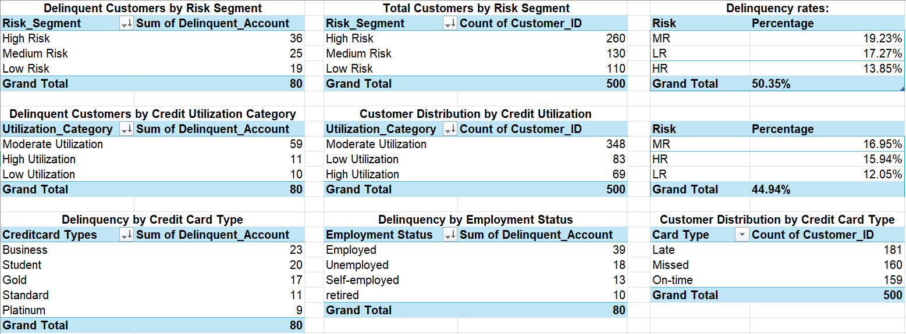
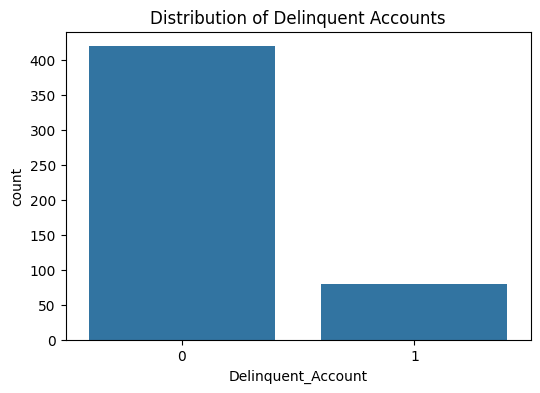
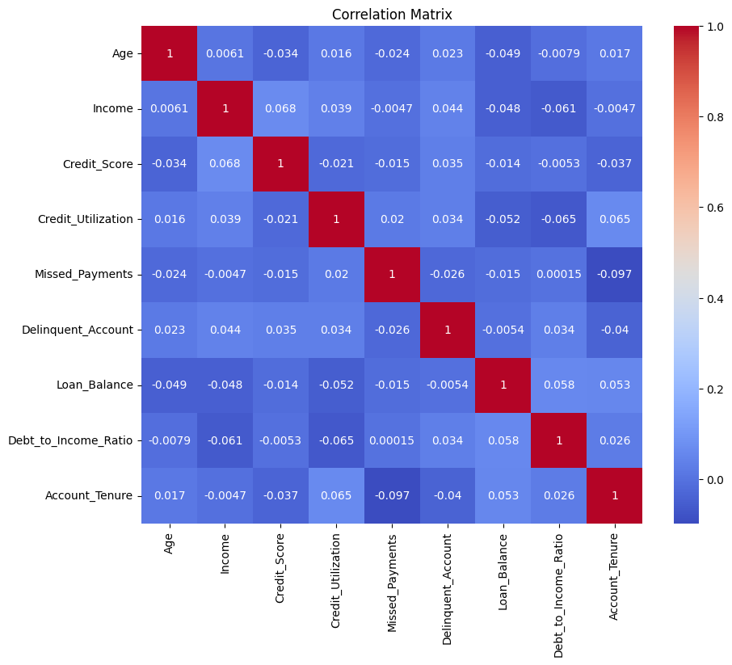
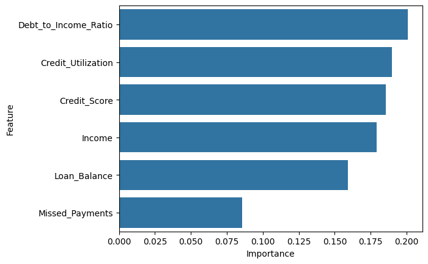

# AI-Powered Credit Risk Analytics

## Project Overview

This project presents an end-to-end Credit Risk Analytics solution developed to identify customer delinquency patterns, assess credit risk, and support data-driven decision-making in financial services.

The project combines Excel, Power BI, Python, Exploratory Data Analysis (EDA), and Machine Learning to analyze customer financial behavior and evaluate factors contributing to credit delinquency.

The workflow follows a complete analytics lifecycle from data cleaning and business intelligence reporting to predictive modeling and business interpretation.

---

## Business Problem

Financial institutions face challenges in identifying customers who are likely to miss payments and become delinquent. Early identification of high-risk customers allows organizations to:

- Reduce delinquency rates
- Improve collection strategies
- Optimize resource allocation
- Enhance customer engagement
- Support proactive risk management

This project aims to analyze customer credit behavior and develop a framework for delinquency risk assessment.

---

## Project Objectives

- Clean and preprocess customer credit data
- Perform exploratory data analysis (EDA)
- Identify key delinquency risk factors
- Develop an interactive Power BI dashboard
- Build machine learning models for delinquency prediction
- Generate business recommendations based on analytical findings

---

## Tools & Technologies

### Excel
- Data Cleaning
- Missing Value Treatment
- Risk Segmentation
- Pivot Tables
- KPI Calculations

### Power BI
- Interactive Dashboard Development
- KPI Monitoring
- Customer Segmentation Analysis
- Business Insight Generation

### Python
- Pandas
- NumPy
- Matplotlib
- Seaborn
- Scikit-Learn

### Machine Learning
- Logistic Regression
- Random Forest Classifier

---

## Dataset

The dataset contains customer financial and behavioral attributes including:

- Age
- Income
- Credit Score
- Credit Utilization
- Missed Payments
- Loan Balance
- Debt-to-Income Ratio
- Employment Status
- Credit Card Type
- Account Tenure
- Delinquency Status

Target Variable:

**Delinquent_Account**
- 0 = Non-Delinquent
- 1 = Delinquent

---

## Repository Structure

```text
AI-Credit-Risk-Analytics
│
├── README.md
├── requirements.txt
├── Delinquency_prediction_dataset.csv
├── Credit_Risk_Analysis.xlsx
├── AI_Credit_Risk_Analytics.pbix
├── credit_risk_analysis.ipynb
├── dashboard.png
├── excel_pivots.png
├── correlation_heatmap.png
├── delinquency_distribution.png
└── feature_importance.png
```

---

## Project Workflow

### Phase 1: Excel Analysis

The initial analysis was performed in Microsoft Excel.

Key activities:

- Data Cleaning
- Missing Value Handling
- Risk Segmentation
- Pivot Table Analysis
- Customer Risk Profiling
- KPI Development

### Excel Analysis Preview



---

### Phase 2: Power BI Dashboard

An interactive dashboard was developed to visualize delinquency trends and customer risk profiles.

Key dashboard components:

- Delinquency Rate KPI
- Customer Segmentation
- Credit Utilization Analysis
- Risk Segment Analysis
- Credit Card Type Analysis
- Employment Status Analysis
- Collection Strategy Recommendations

### Dashboard Preview


---

### Phase 3: Python Analytics

Python was used for:

- Data Cleaning
- Exploratory Data Analysis
- Statistical Analysis
- Correlation Analysis
- Feature Engineering
- Predictive Modeling

---

## Exploratory Data Analysis (EDA)

### Key Analyses Performed

- Missing Value Analysis
- Duplicate Record Analysis
- Distribution Analysis
- Delinquency Trend Analysis
- Outlier Detection
- Correlation Analysis
- Risk Factor Identification

### Sample Visualizations

#### Delinquency Distribution



#### Correlation Heatmap



#### Feature Importance



---

## Key Findings

### Major Delinquency Risk Factors

- Lower Credit Scores are associated with higher delinquency risk.
- Customers with multiple missed payments are more likely to become delinquent.
- Higher Credit Utilization indicates increased financial stress.
- Higher Debt-to-Income Ratios contribute to repayment difficulties.
- Loan Balance influences delinquency behavior.

### Business Insights

- High-risk customers contribute the largest proportion of delinquent accounts.
- Moderate and high credit utilization groups account for most delinquent customers.
- Missed payment behavior serves as an early warning signal.
- Targeted intervention strategies can improve collection efficiency.

---

## Machine Learning Models

Two machine learning models were evaluated:

### 1. Logistic Regression

Purpose:

- Baseline classification model
- Predict customer delinquency risk

### 2. Random Forest Classifier

Purpose:

- Capture non-linear relationships
- Evaluate potential performance improvements

---

## Model Results

The dataset contains:

- 420 Non-Delinquent Customers (84%)
- 80 Delinquent Customers (16%)

This significant class imbalance impacted predictive performance.

### Key Observation

Although the models achieved acceptable overall accuracy, they struggled to accurately identify delinquent customers.

This highlights a common real-world challenge in credit risk modeling where:

- Class imbalance affects model learning
- Additional feature engineering may be required
- Larger datasets may improve prediction performance
- Advanced balancing techniques may be necessary

---

## Business Interpretation

The analysis demonstrates that customer delinquency is influenced by multiple financial and behavioral factors.

Important indicators include:

- Credit Score
- Credit Utilization
- Missed Payments
- Debt-to-Income Ratio
- Loan Balance

These insights can support:

- Risk-based customer segmentation
- Early intervention programs
- Improved collection strategies
- Data-driven credit risk management

---

## Recommendations

### High-Risk Customers

- Immediate collections outreach
- Payment plan review
- Enhanced account monitoring

### Medium-Risk Customers

- Personalized repayment plans
- Proactive communication campaigns

### Low-Risk Customers

- Automated reminders
- Routine account monitoring

---

## Future Improvements

Potential enhancements include:

- SMOTE for class balancing
- Advanced feature engineering
- Gradient Boosting Models
- XGBoost Implementation
- Additional customer behavioral variables
- Real-time risk monitoring systems
- Automated intervention recommendation engines

---

## Conclusion

This project demonstrates a complete analytics workflow covering:

- Data Cleaning
- Data Preprocessing
- Exploratory Data Analysis
- Business Intelligence Reporting
- Credit Risk Assessment
- Machine Learning
- Model Evaluation
- Business Interpretation

The project provides a practical example of how analytics can support financial institutions in understanding customer risk behavior and improving delinquency management strategies.

---

## Acknowledgements

This project was inspired by and developed as an extended portfolio implementation of the Tata iQ GenAI Powered Data Analytics Job Simulation hosted on Forage.

The original simulation focuses on applying AI-powered analytics, exploratory data analysis, predictive modeling, business recommendations, and responsible AI principles within a financial services scenario involving customer delinquency risk assessment.

Simulation Link:

https://www.theforage.com/simulations/tata/data-analytics-t3zr

This repository expands the original simulation by developing:

- Excel-based data preparation workflows
- Power BI dashboard development
- Python-based exploratory data analysis
- Machine learning models
- Business interpretation and recommendations
- GitHub portfolio documentation

---

## Disclaimer

This repository is an independent educational portfolio project and is not an official Tata Group, Tata iQ, Geldium Finance, or Forage project.

All analysis, visualizations, modeling decisions, and business recommendations presented here are my own work and were developed for educational and portfolio purposes.
